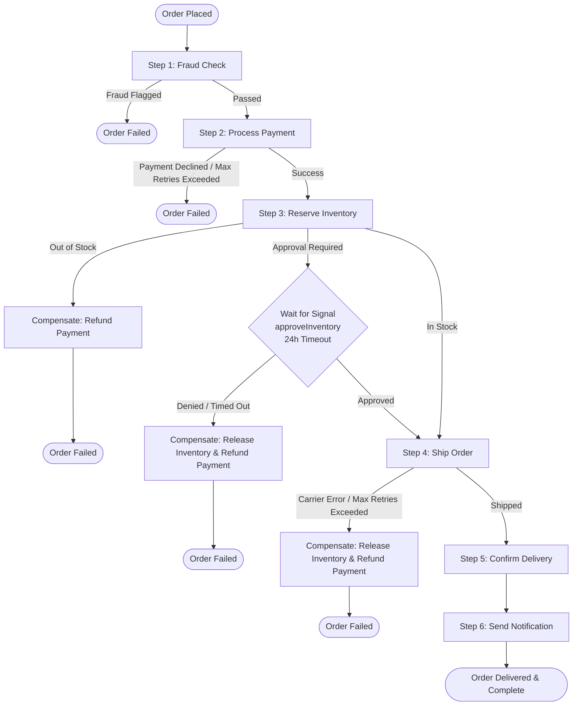

# Temporal Workflow Orchestration: Production-Grade Order Processing

[](https://github.com/jbirdkerr/temporal-order-processing/actions/workflows/ci.yml)
[](https://golang.org)
[](https://temporal.io)

An observable, resilient order processing saga built with **Temporal**, **Go**, and **OpenTelemetry**.

---

## Overview & Saga Architecture

This project implements a multi-step, distributed order processing workflow using the **Saga Pattern**. Every step provides automatic retries, timeouts, human-in-the-loop signal handling, and backward compensation (e.g., releasing inventory and refunding payments) if downstream actions fail.



---

## Features

- **Distributed Saga Orchestration**: Automatic compensating transactions for partial failure recovery.
- **Human-in-the-Loop Workflow**: Supports Temporal signals for manual approval holds with timed expiration.
- **Idempotency**: Workflow ID deduplication ensures orders are never double-processed.
- **Full Observability**:
  - **Metrics**: Native Prometheus metrics for each activity and state transition.
  - **Distributed Tracing**: OpenTelemetry (OTel) gRPC exporter compatible with Jaeger, Grafana Tempo, and OTel Collectors.
  - **Workflow History**: Temporal Web UI for timeline inspection, replays, and execution state.
- **Containerized & CI-Ready**: Multi-stage Docker builds, Docker Compose profiles, and GitHub Actions CI.

---

## Project Structure

```
.
├── cmd/
│   ├── server/         # REST API server (HTTP routes, metrics, Temporal client)
│   └── worker/         # Temporal Worker (registers workflows and activities)
├── deploy/
│   └── docker/         # Production multi-stage Dockerfiles (server & worker)
├── docs/               # Project specifications and guides
├── internal/
│   ├── activity/       # Temporal Activity implementations (Payment, Inventory, Shipping, Fraud, Notification)
│   ├── domain/         # Domain models and status definitions
│   ├── observability/  # Prometheus metrics and OpenTelemetry tracer setup
│   └── workflow/       # Order processing workflow definition and signals
├── tests/
│   ├── activity/       # Activity unit tests
│   └── workflow/       # Temporal workflow integration and saga tests
├── docker-compose.yml  # Local infrastructure & full stack definition
├── prometheus.yml      # Prometheus scrape configuration
└── .github/workflows/  # CI workflow (lint, vet, build, test)
```

---

## Quick Start

### Prerequisites
- [Docker & Docker Compose](https://docs.docker.com/get-docker/)
- [Go 1.25+](https://golang.org/dl/) *(optional if using Docker Compose)*

---

### Option A: Run Full Stack with Docker Compose (Recommended)

Start the backing infrastructure along with the containerized server and worker:

```bash
docker compose --profile app up --build
```

---

### Option B: Local Go Development

1. **Start backing infrastructure only:**
   ```bash
   docker compose up
   ```

2. **In a new terminal, start the worker:**
   ```bash
   go run cmd/worker/main.go
   ```

3. **In a third terminal, start the REST API server:**
   ```bash
   go run cmd/server/main.go
   ```

---

## Observability & Dashboards

Once services are running, the following dashboards are accessible:

| Service | URL | Description |
|---|---|---|
| **Temporal UI** | [http://localhost:8233](http://localhost:8233) | Real-time workflow status, step timelines, and execution histories |
| **REST API Server** | [http://localhost:8080](http://localhost:8080) | Order submission and status API |
| **Prometheus** | [http://localhost:9090](http://localhost:9090) | Scraped metrics & Prometheus query browser |
| **Jaeger UI** | [http://localhost:16686](http://localhost:16686) | Distributed traces and span waterfall views |
| **Grafana** | [http://localhost:3000](http://localhost:3000) | Dashboard analytics (Default login: `admin` / `admin`) |

---

## Testing the API

### 1. Submit an Order
```bash
curl -X POST http://localhost:8080/orders \
  -H "Content-Type: application/json" \
  -d '{
    "id": "ORD-1001",
    "customer_id": "cust-456",
    "items": [
      { "sku": "SKU-WIDGET", "name": "Standard Widget", "quantity": 2, "price": 50.0 }
    ],
    "total_amount": 100.0,
    "shipping_address": {
      "street": "123 Main St",
      "city": "Portland",
      "state": "OR",
      "zip_code": "97201",
      "country": "USA"
    }
  }'
```

### 2. Check Execution Status
```bash
curl http://localhost:8080/orders/ORD-1001
```

### 3. Retrieve Workflow Result
```bash
curl http://localhost:8080/orders/ORD-1001/result
```

### 4. Inspect Health & Metrics
```bash
curl http://localhost:8080/health
curl http://localhost:8080/metrics
```

---

## Running Tests

Run the test suite locally with race detection:

```bash
go test -v -race -count=1 ./...
```
